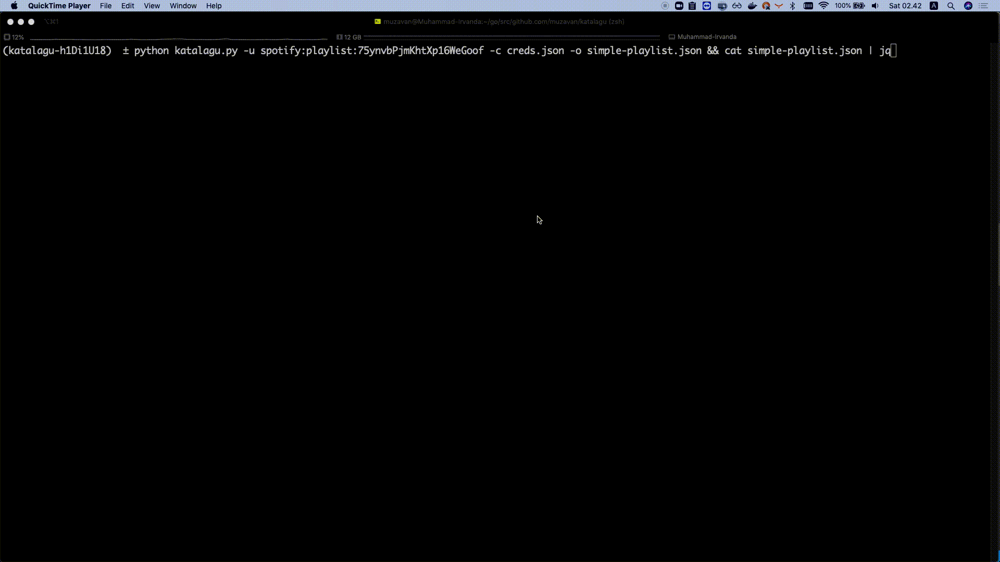

# KataLagu


KataLagu (literal translation from Bahasa Indonesia, *Song's Word*) is a simple python cli to fetch all registered [Genius](https://genius.com/) lyrics from a [Spotify](https://www.spotify.com/) playlist.




# Usage

*You need to install [Pipenv](https://pipenv.pypa.io/en/latest/) first.*

You can clone this github and run `pipenv install` to create virtual environment and install all dependencies.

```
python katalagu.py --help
Usage: katalagu.py [OPTIONS]

Options:
  -u, --uri TEXT          Spotify URI to the playlist. You can find it in
                          Share > Copy Spotify URI. Should be in
                          'spotify:playlist:...' format  [required]

  -c, --creds-json TEXT   Path to credentials json file. The format can be
                          seen in creds.json.sample  [required]

  -o, --output-json TEXT  Path to lyrics json file. If not set, will output to
                          current directory with <playlist_id>.json

  -t, --tracks-only       Using this flag, katalagu will only fetch the tracks
                          list for the playlist.

  --help                  Show this message and exit.
```

You need to setup your credentials json first. This is needed to call Spotify API and Genius API (see `creds.json.sample`).

```
{
    "spotify": {
        "client_id": "id",
        "client_secret": "secret"
    },
    "genius": {
        "client_access_token": "token"
    }
}
```

You can get it in [Spotify for Developer](https://developer.spotify.com/) page and [Genius Developers](https://genius.com/developers).

# Sample

Several katalagu's result (title, artist, lyrics) from playlist that I listen to lately. 

| Playlist      	| JSON                                            	|
|--------------	|---------------------------------------------------	|
| [This is Dewa](https://open.spotify.com/playlist/37i9dQZF1DXbcrxvoaNyDy)    	| [JSON](./raw/lyric/37i9dQZF1DXbcrxvoaNyDy.json)                       	|
| [This is: Noah](https://open.spotify.com/playlist/37i9dQZF1DWW21j5DuKqBx) 	| [JSON](./raw/lyric/37i9dQZF1DWW21j5DuKqBx.json)                        	|
| [Indonesia 2000an](https://open.spotify.com/playlist/758B9GF7qrfggUiLkhEC1q?si=ZR4hPvOqSdKpNcJ3b6vblw) 	| [JSON](./raw/lyric/758B9GF7qrfggUiLkhEC1q.json)                                            	|


# Attribution

This simple CLI can not be made without works from:
- [Spotify](https://www.spotify.com/)
- [Genius](https://genius.com/)
- All developers that create/contributed to [dependency used](./Pipfile) in this project.